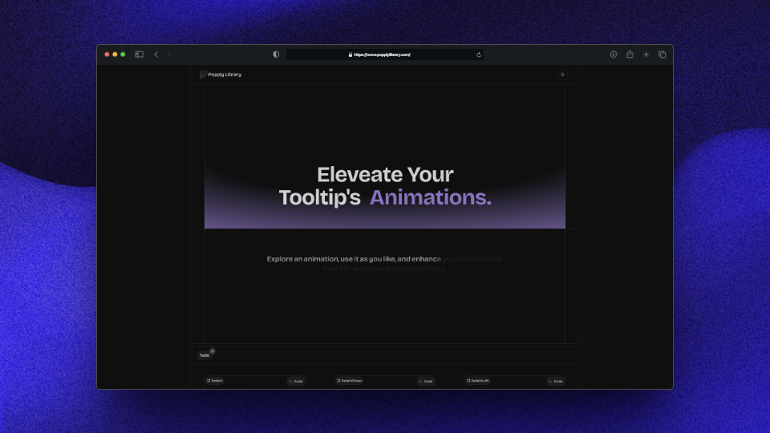
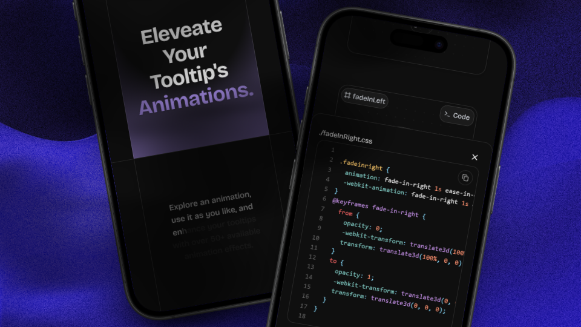

Welcome to **Popply**, a refined animation library for tooltips—those subtle yet powerful UI elements that enhance user guidance and interaction.

Tooltips are typically activated by a `mouseEnter` event. With **Popply**, bringing them to life is seamless and efficient.  
Simply copy the desired animation, place it into your `./styles` folder, and apply it to any tooltip that could use a touch of motion.

Explore a curated collection of **50+ animations**, including `fadeIn`, `slideIn`, `flyIn`, `punchIn`, `zoomIn`, and many others—each designed to complement your user experience with precision.

Start exploring and find the animation that best aligns with your design vision.


# Preview 

By default, **Popply** animations are adaptive, this ensures smooth performance on all devices.  
However, tooltips often behave differently on desktop (hovering) and mobile (tapping), so it is important to preview them in both contexts.



On mobile, consider triggering tooltips via ```onClick```, or accessibility-focused interactions.  




> [!IMPORTANT]
> **Popply** is a free and open source project.
> If you find it useful, please consider [donating](https://buymeacoffee.com/jhojanggar6).

<video controls src="./public/assets/preview.mp4" title="Title" mute></video>


